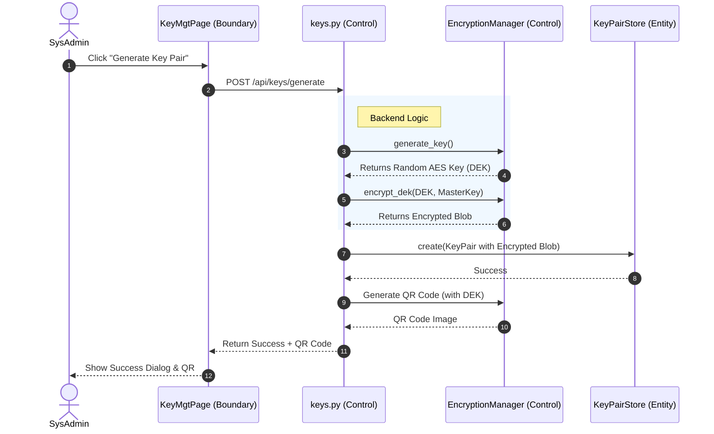
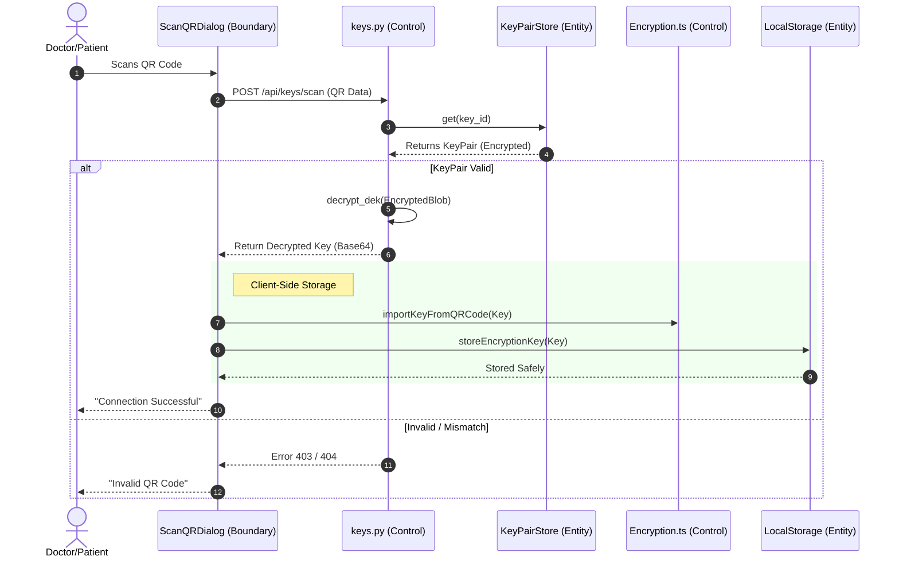
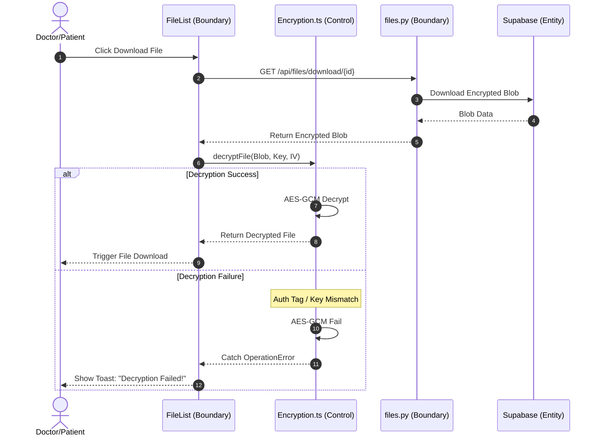

# Design Specification: User Stories & Diagrams

## 1. User Stories & Function Mapping

We have mapped your user stories to specific functions in the codebase.
**Recommendation**: 
- Combine **[DR] #2** and **[PT] #2** into a single "Establish Connection" story.
- Combine **[DR] #17** and **[PT] #14** into a single "Secure Decryption" story.

| User Story | ID | Primary Goal | Backend Function (`backend/`) | Frontend/Service (`frontend/`) |
| :--- | :--- | :--- | :--- | :--- |
| **SysAdmin** | [SA] #2 | Generate Key Pair | `keys.generate_key_pair()` | `keyService.generateKeyPair()` |
| **Doctor** | [DR] #2 | Connect via QR | `keys.scan_qr_code()` | `keyService.scanQRCode()` |
| **Patient** | [PT] #2 | Connect via QR | `keys.scan_qr_code()` | `keyService.scanQRCode()` |
| **Doctor** | [DR] #17 | Decryption Failure Notification | N/A (Client-side fail) | `Encryption.decryptFile()` (catches error) |
| **Patient** | [PT] #14 | Decryption Failure Notification | N/A (Client-side fail) | `Encryption.decryptFile()` (catches error) |

---

## 2. Use Case Diagram

This diagram shows the high-level interactions between actors and the system.

```mermaid
usecaseDiagram
    actor "SysAdmin" as SA
    actor "Doctor" as DR
    actor "Patient" as PT

    package "File Encryption App" {
        usecase "Generate Encryption Key Pair" as UC1
        usecase "View Connection QR" as UC2
        usecase "Scan QR to Connect" as UC3
        usecase "Encrypt & Upload File" as UC4
        usecase "Download & Decrypt File" as UC5
    }

    SA --> UC1
    SA --> UC2
    
    DR --> UC3
    DR --> UC4
    DR --> UC5

    PT --> UC3
    PT --> UC4
    PT --> UC5

    UC3 ..> UC2 : includes
```

---

## 3. BCE (Boundary-Control-Entity) Sequence Diagrams

### Sequence 1: Generate Key Pair ([SA] #2)
**Goal:** Create a secure communication channel (Key Pair) between Doctor and Patient.



### Sequence 2: Establish Connection / Scan QR ([DR] #2, [PT] #2)
**Goal:** Securely transfer the encryption key to the user's device via QR code.



### Sequence 3: File Decryption & Failure Handling ([DR] #17, [PT] #14)
**Goal:** Decrypt a downloaded file and notify the user if data integrity is compromised.


